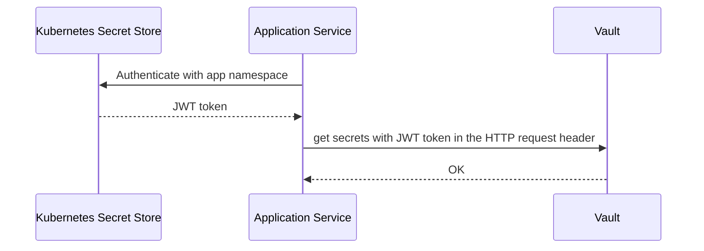
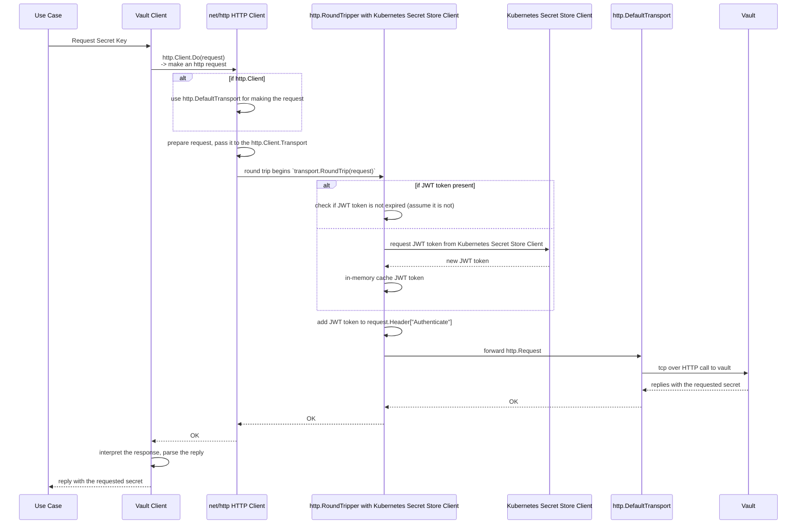

# Hashicorp Adapter

## Kubernetes Secret Store + Vault

**high-level**:

**Go http.RoundTripper based pipeline**:

- you make a k8s Secret Store Client
- Then you create a http.RoundTripper that contains the next round tripper
  - by referencing the next round tripper, we can build an HTTP round tripper sequence,
    often referenced as http client middleware stack / pipeline.
- Then you inject the configured http client into the vault client
- Then when the vault client makes a request towards the Vault Server
  - the http client round trip begins, and each round tripper will call the next
