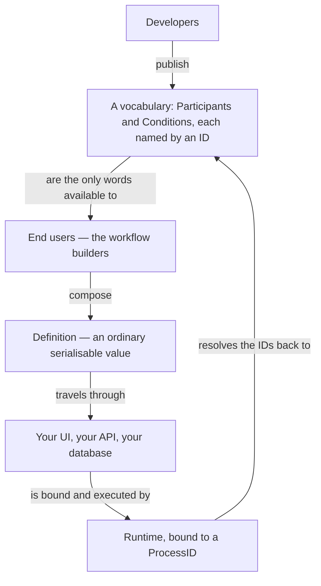

# End Users / Workflow Builders

> **The thesis:** a workflow definition is *data*, not code. Every other design
> decision in this package is downstream of that one.

---

## Who the end user is

The end user is whoever composes workflows. The package deliberately does not
care who that turns out to be in your system:

- a non-developer clicking through a builder UI in your product;
- an ops engineer editing a stored JSON document;
- the very same developers who wrote the participants, writing Go.

What the package refuses to do is *assume* that person can redeploy your binary.
Once you accept that a workflow may be authored by someone who cannot ship code,
the definition has to be a value that travels — and everything else follows.

---

## What "definition is data" buys you

A `Definition` is an ordinary Go value that survives a [Codec][CODEC] round
trip. That single property cashes out everywhere:

| Because a definition is data…               | You get                                                              |
| ------------------------------------------- | --------------------------------------------------------------------- |
| It is inert — it describes, it does not run | It can be built in a browser and POSTed to your API.                  |
| It serialises                               | It lives in the database you already operate. No new datastore.       |
| It is a value                               | You can diff two of them, review them, put them behind approval.      |
| It is bound per `ProcessID`                 | You can audit and replay one customer's process specifically.         |

The headline consequence: **shipping a new business process stops being a
deployment.** A new definition is a row, not a release.

---

## The contract this creates for developers

If definitions are authored elsewhere, then your [Participants][PARTICIPANT] and
[Conditions][CONDITION] are not internal helpers — they are your **public API
surface for workflow builders**. You are publishing a vocabulary, which changes
how you write them:

| Guideline                                                        | Why                                                                     |
| ---------------------------------------------------------------- | ------------------------------------------------------------------------ |
| Name for the domain (`refund-order`), not the mechanism (`post-http`) | The builder is reasoning about the business, not about your stack.   |
| Keep them coarse enough to mean something on their own            | A participant is a sentence in the builder's language, not a keystroke.  |
| Make them safe to compose in an order you did not anticipate      | You cannot see the workflows your users will write.                     |
| Make them repeatable                                              | The runtime replays; a step may be re-entered after a crash or requeue. |
| Reserve `workflow.ErrFatal` for failures a retry can never fix    | Everything else is retried and requeued, which is usually what you want. |

The uncomfortable half is worth stating plainly: **a participant will be called
in situations you did not design for.** That is not a leak in the abstraction,
it is the entire point of separating vocabulary from composition — and it is why
the idempotency and `ErrFatal` rules are rules rather than suggestions.

When one participant really needs several independently retryable steps, return
a `workflow.Sequence` from it instead of doing all the work inline. The runtime
persists your result with that definition attached and runs the steps as
first-class, individually recoverable stages.

---

## Versioning is just the event log

There is no separate "workflow version" concept, and none is needed: the
sequence of `EventUseDefinition` entries on a Process **is** its version history.

| Operation      | What it actually is                                                                                  |
| -------------- | ------------------------------------------------------------------------------------------------------ |
| **Replay**     | `Runtime.Execute` reads the latest `EventUseDefinition` and re-runs it; recorded steps short-circuit.  |
| **Migration**  | Write a new `EventUseDefinition` for an existing `ProcessID` — via a `workflow.Replace{Definition}` signal, or a one-shot migration tool. |
| **Rollback**   | Rewrite or remove events; the replay loop recomputes from whatever is left.                             |

A migration never rewrites old events. They stay in the log, so the audit trail
still shows which definition a process was running when each step happened.

---

## The trust boundary

Treat end-user-authored definitions as **untrusted input**, because that is what
they are. The design makes this survivable:

- A definition can only *name* participants and conditions by ID. It cannot
  express arbitrary code, arbitrary calls, or arbitrary I/O.
- An ID you never registered resolves to `ErrParticipantNotFound` /
  `ErrConditionNotFound`, which are fatal — the process stops rather than
  retrying forever.
- The [Codec][CODEC] only reconstructs the definition and condition types it has
  been taught, so an unknown type on the wire fails to decode at the boundary.

So the worst a hostile definition can do is compose the capabilities you already
chose to publish, in an order you did not expect. **That containment is what
makes end-user composition viable at all.**

Next: [Definitions][DEFINITION] for the building blocks,
[Participants][PARTICIPANT] for publishing your vocabulary well, or the
[Glossary][GLOSSARY] when a word does not click.

[GLOSSARY]: ./glossary.md
[DEFINITION]: ./definition.md
[PARTICIPANT]: ./participant.md
[CONDITION]: ./condition.md
[CODEC]: ./codec.md
