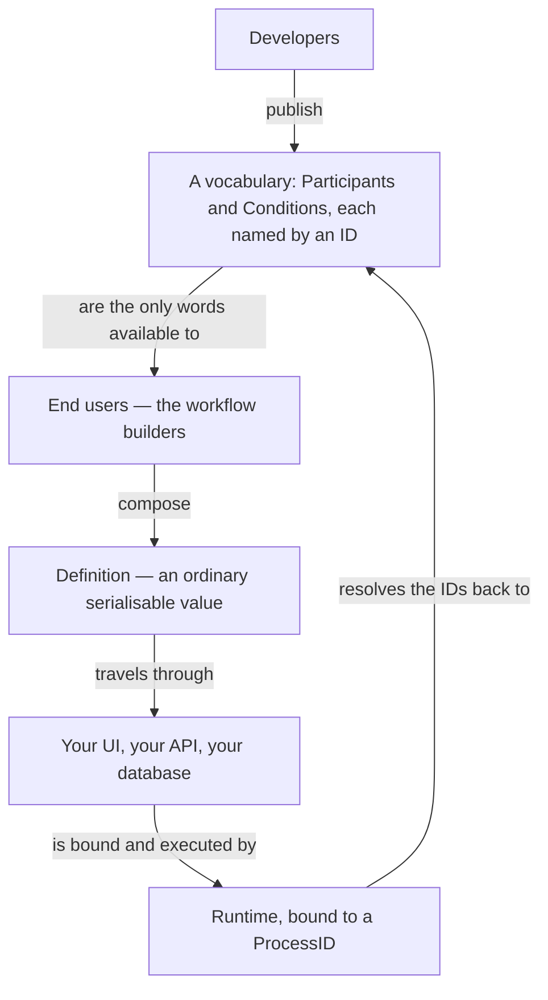

# End Users / Workflow Builders

> **The thesis:** a workflow definition is *data*, not code. Every other design
> decision in this package is downstream of that one.

---

## Who the end user is

The end user is whoever composes workflows. The package deliberately does not
care who that turns out to be in your system:

- a non-developer clicking through a builder UI in your product;
- an ops engineer editing a stored JSON document;
- the very same developers who wrote the participants, writing Go.

What the package refuses to do is *assume* that person can redeploy your binary.
Once you accept that a workflow may be authored by someone who cannot ship code,
the definition has to be a value that travels — and everything else follows.

---

## What "definition is data" buys you

A `Definition` is an ordinary Go value that survives a [Codec][CODEC] round
trip. That single property cashes out everywhere:

| Because a definition is data…               | You get                                                              |
| ------------------------------------------- | --------------------------------------------------------------------- |
| It is inert — it describes, it does not run | It can be built in a browser and POSTed to your API.                  |
| It serialises                               | It lives in the database you already operate. No new datastore.       |
| It is a value                               | You can diff two of them, review them, put them behind approval.      |
| It is bound per `ProcessID`                 | You can audit and replay one customer's process specifically.         |

The headline consequence: **shipping a new business process stops being a
deployment.** A new definition is a row, not a release.

---

## The contract this creates for developers

If definitions are authored elsewhere, then your [Participants][PARTICIPANT] and
[Conditions][CONDITION] are not internal helpers — they are your **public API
surface for workflow builders**. You are publishing a vocabulary, which changes
how you write them:

| Guideline                                                        | Why                                                                     |
| ---------------------------------------------------------------- | ------------------------------------------------------------------------ |
| Name for the domain (`refund-order`), not the mechanism (`post-http`) | The builder is reasoning about the business, not about your stack.   |
| Keep them coarse enough to mean something on their own            | A participant is a sentence in the builder's language, not a keystroke.  |
| Make them safe to compose in an order you did not anticipate      | You cannot see the workflows your users will write.                     |
| Make them repeatable                                              | The runtime replays; a step may be re-entered after a crash or requeue. |
| Reserve `workflow.ErrFatal` for failures a retry can never fix    | Everything else is retried and requeued, which is usually what you want. |

The uncomfortable half is worth stating plainly: **a participant will be called
in situations you did not design for.** That is not a leak in the abstraction,
it is the entire point of separating vocabulary from composition — and it is why
the idempotency and `ErrFatal` rules are rules rather than suggestions.

A participant can return a `workflow.Sequence` to describe follow-up stages.
A cached producer is not called again, but its recorded definition is walked
again so suspended work resumes. These nested stages still share the producer's
event transaction: an ordinary failure can roll back earlier nested success
events, so they are **not independent top-level commit boundaries**.

Use separate top-level steps when you need those boundaries. In either layout,
external effects must be idempotent and safe to retry: an effect may succeed
before its event is durably recorded, and a write/commit failure, crash, or
rollback can make it repeat. Use stable business idempotency keys or a shared
transaction/outbox where applicable.

---

## Versioning is just the event log

There is no separate "workflow version" concept, and none is needed: the
sequence of `EventUseDefinition` entries on a Process **is** its version history.

| Operation      | What it actually is                                                                                  |
| -------------- | ------------------------------------------------------------------------------------------------------ |
| **Replay**     | `Runtime.Execute` reads the latest `EventUseDefinition` and re-runs it; recorded steps short-circuit.  |
| **Migration**  | Write a new `EventUseDefinition` for an existing `ProcessID` — via a `workflow.Replace{Definition}` signal, or a one-shot migration tool. |
| **Undoing work** | `Replace` the definition with one that compensates, such as a refund; committed events are never rewritten. |

A migration never rewrites old events. They stay in the log, so the audit trail
still shows which definition a process was running when each step happened.

Template conditions (`wftemplate.Condition`) now record their answers, like
registered conditions always did. Histories from before that hold no recorded
template answer, so they cannot reconstruct a past choice: the first
post-upgrade evaluation uses current scoped variables. Explicitly migrate
processes where that could select an unsafe branch. Paths identify steps, not a
variable timeline; see [Conditions][CONDITION].

---

## The trust boundary

Treat end-user-authored definitions as **untrusted input**, because that is what
they are. The design makes this survivable:

- A definition can only *name* participants and conditions by ID. It cannot
  express arbitrary code, arbitrary calls, or arbitrary I/O.
- A participant ID missing on the executing node produces
  `workflow.ErrParticipantNotFound{ID: id}`, even if no `Participants` repository
  is configured. This is a plain, nonfatal availability error, not a runtime
  signal. An incompatible registration produces the nonfatal
  `ErrParticipantSignatureMismatch{ID, Cause}`, preserving the original invalid-function
  or mapping error. Missing condition IDs still produce a fatal `ErrConditionNotFound`.
- The [Codec][CODEC] only reconstructs the definition and condition types it has
  been taught, so an unknown type on the wire fails to decode at the boundary.

So the worst a hostile definition can do is compose the capabilities you already
chose to publish, in an order you did not expect. **That containment is what
makes end-user composition viable at all.**

Builders should validate participant IDs independently against the capabilities
available across their deployment, not just one node's registrations. Rescheduling
is not validation: a typo or an ID that no node provides leaves the process
waiting for availability indefinitely. Validate participant signatures and
variable mappings as well as condition IDs.

A fatal execution error causes the scheduler to warn and ACK/drop that queue
entry, not kill the worker. The process remains incomplete and nonterminated;
after correcting the cause, the caller can `Schedule` the same ID again.

## Specialised nodes can share execution

Nodes with different participant registrations can share the same queue, events,
locks and notifications. Missing or incompatible participant availability skips
tight local retries and defers execution until after `WaitTime`, incrementing
`ExecutionRequest.FailureCount` while preserving earlier work and cached
completed steps. It records no `EventError` for the unavailable invocation
(see [Participants][PARTICIPANT]).

`Runtime.ParticipantWarningInterval` warns every N such scheduling failures,
with a default of **5** (zero or negative values use the default). There is no
hard failure-count drop limit; these warnings are operational visibility, not
capability routing.

A later attempt can run on another node and reuse that work. This lets differently
specialised nodes take turns, but introduces **no routing changes**: there is no
capability-aware routing or guarantee that the next attempt lands on a node with
the required ID.

Next: [Definitions][DEFINITION] for the building blocks,
[Participants][PARTICIPANT] for publishing your vocabulary well, or the
[Glossary][GLOSSARY] when a word does not click.

[GLOSSARY]: ./glossary.md
[DEFINITION]: ./definition.md
[PARTICIPANT]: ./participant.md
[CONDITION]: ./condition.md
[CODEC]: ./codec.md
