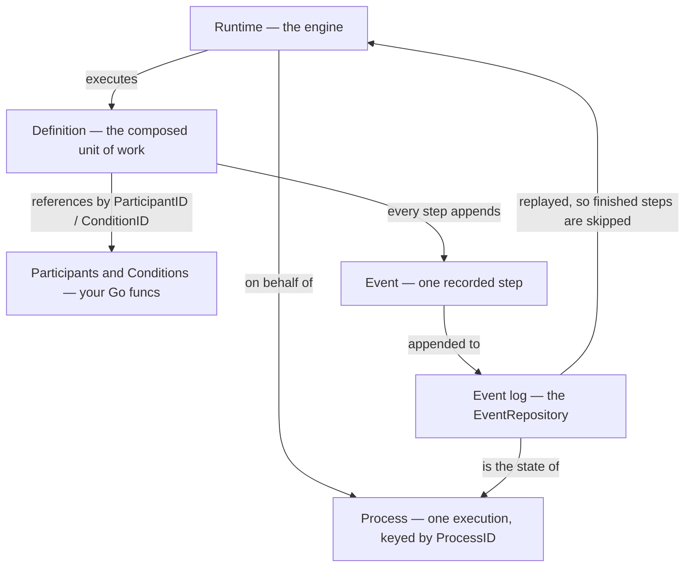

# Glossary

> Open this page when a word does not click. Terms are grouped by the layer they
> belong to, and each one says who is expected to maintain it.

## How the pieces relate



## Who maintains what

| Term                       | Maintained by       | In one line                                         |
| -------------------------- | ------------------- | --------------------------------------------------- |
| **Definition**             | your end-users      | The composition — what should happen, in what order. |
| **Participant, Condition** | you, the developer  | The vocabulary — what *can* happen at all.          |
| **Process, Event, Path**   | the workflow engine | The bookkeeping — what already happened.            |

---

## The composition layer

### Definition

*Maintained by the end-users.*

The unit of work. A `Definition` is an ordinary Go value that **describes** what
should happen; it is not code that happens on its own.

```go
type Definition interface {
	Execute(ctx context.Context, processID ProcessID) error
	error // yes, an embedded error — see below
}
```

Three properties the runtime leans on:

| Property         | Why it is required                                                                                                                |
| ---------------- | --------------------------------------------------------------------------------------------------------------------------------- |
| **Serialisable** | It is persisted inside an `EventUseDefinition` and round-tripped through the [Codec][CODEC], so a process can be stored and reloaded. |
| **Stateless**    | It carries no per-process state of its own. Everything that varies lives in the event log.                                          |
| **Idempotent**   | The runtime may re-run it after a crash, a retry, or a requeue, and the effects must converge to the same state.                     |

The embedded `error` is deliberate. Participant functions return `error`, so
making every `Definition` also an `error` lets a participant *return a
definition* — "I am done, now please also run these steps". The runtime persists
the participant's result with that definition attached and continues with it.

Built-ins: `Sequence`, `If`, `Sleep`, `SetVar`, `DeclareVar`, `DeleteVar`,
`ExecuteParticipant`, `ExecuteCondition`, `Spawn`, `Join`. See
[Definitions][DEFINITION].

### Participant

*Maintained by the developers.*

Domain logic you publish for workflow builders to use. It is an ordinary Go
function registered under a `ParticipantID`:

```go
Participants: workflow.Participants{
	"charge-card": func(ctx context.Context, orderID string) (receipt string, _ error) { ... },
}
```

The signature must be `func(context.Context, ...ins) (...outs, error)`. A
definition invokes it with `ExecuteParticipant{ID, Input, Output}`, which maps
process variables positionally onto the arguments and results.

Every call is recorded as an `EventParticipant` and **replayed from the log** on
a re-execution, so a retried process does not call your function twice for the
same step. The recorded result is re-used as long as the step's input values are
unchanged; if they differ, the step is genuinely re-run. Because the log is the
cache, participants are expected to be repeatable rather than perfectly
idempotent themselves.

`workflow.ErrFatal` marks an unrecoverable failure: `ErrIsFatal` reports it, and
the runtime stops retrying instead of burning through the retry budget.

See [Participants][PARTICIPANT].

### Condition

*Maintained by the developers.*

A predicate, published the same way a participant is:

```go
type Condition interface {
	Evaluate(ctx context.Context, processID ProcessID) (bool, error)
}
```

Registered Go funcs (`workflow.Conditions`, signature
`func(context.Context, ...ins) (bool, error)`) are reached from a definition via
`ExecuteCondition{ID, Input}`. `wftemplate.Condition` is the shorthand that
evaluates a Go template expression against the process variables instead.

The answer is recorded as an `EventCondition`, so a replay re-uses the *same*
yes/no it originally got (unless the condition's inputs changed) and a branch
cannot flip halfway through a process.

See [Conditions][CONDITION].

---

## The execution layer

### Process

*Maintained by the workflow engine.*

One instance of a workflow execution, identified by a `ProcessID`.

A Process is intentionally stateless: it carries **only its ID**. There is no
process struct, no status column, no in-memory session. Its entire state is the
set of `Event`s recorded against that ID.

### ProcessID / EventID

Both are `uuid.UUID` (`MakeProcessID()`, `MakeEventID()`), and both are **UUID
v7**.

Why v7 matters: v7 UUIDs sort by creation time. The event log therefore has a
reliable total order derived from the identifiers themselves, so folding the log
(variables, idempotency lookups) never has to trust wall-clock timestamps, which
can be coarse, frozen in tests, or skewed between nodes.

You mint the `ProcessID`, not the runtime. A zero ID is refused on purpose: if
your `Bind`/`Schedule` call times out and you retry, reusing the same ID is what
keeps the retry from silently starting a second process.

### Event

*Maintained by the workflow engine.*

One recorded fact about a process. The log of events **is** the process state.

```go
type Event interface {
	EventType() EventType
	GetEventID() EventID
	GetProcessID() ProcessID
	GetTimestamp() time.Time
}
```

| Event                | `EventType()`                     | Recorded when                                                   |
| -------------------- | --------------------------------- | --------------------------------------------------------------- |
| `EventUseDefinition` | `workflow::set-definition-event`  | A definition is bound to the process — or replaced.             |
| `EventParticipant`   | `execute-participant`             | A participant ran; holds its input, output, and any follow-up definition. |
| `EventCondition`     | `execute-condition`               | A condition was evaluated; holds the `Answer`.                  |
| `EventDeclareVar`    | `workflow::event::var::declare`   | A variable came into existence in a scope, with no value yet.    |
| `EventSetVar`        | `workflow::event::var::set`       | A variable was assigned a value.                                 |
| `EventDeleteVar`     | `workflow::event::var::delete`    | A variable binding was removed.                                  |
| `EventSpawn`         | `workflow::event::spawn`          | A sub-workflow was requested; links parent to `ChildID`.        |
| `EventJoin`          | `workflow::event::join`           | A parent observed its children as complete.                      |
| `EventCompleted`     | `workflow::completed`             | The definition finished successfully.                            |
| `EventTerminated`    | `workflow::terminated`            | The process was called off via `rt.Terminate`. The two terminal events are mutually exclusive on the log. |

### Runtime

The engine. A plain struct of interfaces — no constructor, no hidden drivers, no
global registry:

```go
rt := workflow.Runtime{Events: ..., Participants: ..., ProcessLockers: ...}
```

Everything it needs is a field you assign, which is why the whole engine runs
in-memory in a unit test and against Postgres in production without a single
line of workflow code changing. See [Getting Started][GETTING_STARTED].

### Bind

`rt.Bind(ctx, pid, def)` records an `EventUseDefinition`. That event is what
makes a Process **exist** — until it is written, the process has no definition
and `Execute` reports `ErrNoProcessDefinition`.

Bind is idempotent: a process that already carries a use-definition event is
left untouched, so a retried `Bind` does not fork the process' history.

### Execute vs Schedule

Two ways to actually run a bound process.

|                | `rt.Execute(ctx, pid)`                       | `rt.Schedule(ctx, pid)`                                       |
| -------------- | -------------------------------------------- | ------------------------------------------------------------- |
| Runs           | here and now, on the caller's goroutine      | later, on a worker node running `rt.Run(ctx)`                 |
| Returns        | when the process finished, suspended, or failed | as soon as the entry is on the queue                          |
| Needs          | an `EventRepository`                          | plus a `ProcessExecutionQueue` and a `ProcessChangeBroadcast`  |
| Good for       | tests, and synchronous request handling      | production durability, suspension, and back-off               |

`Execute` replays the process: it reads the most recent `EventUseDefinition` and
runs it, while each step short-circuits on its own recorded event. That is why
re-running it is safe.

`rt.Run(ctx)` is the worker loop. It subscribes to the execution queue, executes
what it takes off it, and requeues anything that suspended.

### Halt

`workflow.Halt{}` is a participant-raised signal that stops the current pass
without requeueing, completing, or terminating the Process. The queue entry is
acknowledged and dropped, and the Process is left **inert** in the event log:
not finished, not retried, not requeued.

A participant raises it the same way it returns `Suspend{}` — in place of `nil`,
from inside the function:

```go
"wait-for-user": func(ctx context.Context, ticketID string) error {
    if !userHasReplied(ctx, ticketID) {
        return workflow.Halt{} // stop asking until the caller re-Schedules
    }
    return nil
},
```

The Halt is the no-reschedule cousin of `Suspend`. The distinction matters
when the wait is for something the runtime cannot poll on its own — a manual
review, a customer reply, a third-party callback — and you do not want the
runtime re-asking on a back-off timer. With `Suspend{}` the runtime would
re-execute the participant every `WaitTime`; with `Halt{}` it does not.

To resume a Halted Process, the caller calls `rt.Schedule(ctx, pid)` again
with the same `ProcessID`. The runtime re-executes the definition from the
beginning — there is no recorded short-circuit, because the Halt-raising call
was deliberately not recorded.

The *inert* state is invisible to the query helpers. `IsCompleted` and
`IsTerminated` both stay `false` for a Halted Process — a Halted Process is
neither finished nor called off, it is paused mid-flight on purpose. If you
want to query "should we resume?", you have to track that out-of-band (for
example by writing a `SetVar` from the Halt-raising participant before it
returns).

See [Signals][SIGNAL].

### Terminate

`rt.Terminate(ctx, pid)` is the way to call a process off from outside the
runtime. It records a single `EventTerminated` and returns, so the next
`rt.Execute(ctx, pid)` short-circuits in its event scan and re-runs nothing.

| Property                                            | What it means                                                                                                                            |
| --------------------------------------------------- | --------------------------------------------------------------------------------------------------------------------------------------- |
| **Idempotent on a terminated process**              | A duplicate call does not grow a second `EventTerminated`; the log stays a reliable answer to *when* the process was stopped.             |
| **Refuses to overwrite a completed process**        | A process that already ran to its natural end keeps its `EventCompleted`; the call returns without appending `EventTerminated`.         |
| **Cancels in-flight work**                          | The runtime acquires the process lock and publishes a `ProcessCancel` over the change broadcast; the in-flight participant sees its `ctx` cancelled and unwinds. |
| **Append-only**                                     | Termination never removes prior events; the full history (`Bind`, every step that did record, then `EventTerminated`) stays auditable. |

The two outcomes — *finished* and *called off* — stay distinct on the log:
`Complete` and `Terminate` each refuse to write over the other's outcome event,
so the queries `IsCompleted` and `IsTerminated` each answer `false` on a history
that holds the *other* outcome. The external runtime method, not the in-process
signals, is the only path that produces `EventTerminated`. See
[Getting Started][GETTING_STARTED] §7 and [Signals][SIGNAL].

### Spawn / Join / SpawnName

Careful — "spawn" names two related things:

| Name                              | What it is                                                             |
| --------------------------------- | ---------------------------------------------------------------------- |
| `rt.Spawn(ctx, id, def)`          | A runtime method: `Bind` followed by `Execute`. Idempotent.            |
| `workflow.Spawn{Name, Definition, Vars}` | A **Definition** that launches a sub-workflow as a separate child Process. |

`workflow.Spawn` writes the `EventSpawn`, the child's own binding, and the
forwarded variables in one transaction, then schedules the child *after* that
transaction commits.

`workflow.Join{SpawnName, Collect}` is the other half: it suspends the parent
until the named child (or every child, when `SpawnName` is empty) has recorded
an `EventCompleted`, then records an `EventJoin`.

**SpawnName** is the human-friendly handle for a child — unique among a given
process' children — and it exists purely so a later `Join` can name which child
it is waiting for.

### RuntimeSignal

An `error` that is **not** a failure. It is the runtime's own control flow,
raised deliberately by a step that ran fine.

| Signal                        | Meaning                                                            |
| ----------------------------- | ------------------------------------------------------------------- |
| `Suspend{}`                   | "Not yet." The process is requeued with a back-off, no failure count. |
| `Complete{}`                  | Record the `EventCompleted` and stop.                                |
| `Replace{Definition}`         | Abandon the in-flight definition and continue from a new one.        |
| `Halt{}`                      | Stop asking the Process about this entry. The queue entry is ACKed and dropped; resuming is the caller's job, via `rt.Schedule`. |
| `Terminate{}`                 | Record the `EventTerminated` and stop. Raised externally by `rt.Terminate`, not by a participant. |

Signals are excluded from retries and from transaction rollbacks on purpose: a
suspension is the scheduler's business, and rolling back on one would discard
the genuine work every enclosing step had already recorded.

See [Signals][SIGNAL].

---

## The data layer

### Variable, VarName, VarScope, VarBinding

A **variable** is not a key-value store. It is a *fold* over the variable events
of a process — `EventDeclareVar`, `EventSetVar`, `EventDeleteVar` — replayed in
`EventID` order. Read them with `workflow.Vars{ProcessID, EventsRepository}` or
`workflow.GetVars(ctx)`.

| Term         | What it is                                                                                            |
| ------------ | ------------------------------------------------------------------------------------------------------ |
| `VarName`    | The name a definition refers to, e.g. `"greeting"`.                                                    |
| `VarScope`   | A `[]string` naming the scope a declaration was made in. A declaration in a scope you cannot see shadows the name. |
| `VarBinding` | The folded result: `{Name, Value, Scope}`.                                                             |

`DeclareVar{..., Global: true}` declares in the root scope, so the name escapes
the scope the step happens to run under. See [Variables][VARIABLES].

### VarMapping

`map[parentVarKey]childVarKey` — a mapping **from parent to child**. Used by
`Spawn.Vars` to seed a child process with values from its parent.

Read a `{"orderID": "id"}` entry as: *take the parent's `orderID`, store it in
the child as `id`.* Parent variables that are not set yet are skipped silently.

### Path

A `[]string` breadcrumb of where execution currently is inside the definition
tree, for example:

```go
workflow.Path{"sequence", "[0]", "set-var"}
```

Each composite definition contributes a segment (`Sequence` adds `sequence` plus
`[i]` per element, `If` adds `if` and `then`/`else`, and so on), rooted at the
`EventUseDefinition` that bound the definition.

Its job is identity. A step's recorded event is matched by `(ID, Path)`, so two
`ExecuteParticipant{ID: "notify"}` entries in the same `Sequence` are distinct
logical steps with independent caches — which is what makes idempotent replay
work without any per-process bookkeeping on your side.

### Codec

Polymorphic (de)serialisation for the interface-typed values — `Definition`,
`Condition`, and `Event` — so a stored definition can be reconstructed as the
right concrete Go type.

The interface is deliberately just `Marshal` + `Unmarshal`, so any
`port/codec.Codec` qualifies. `wfjson.NewCodec()` is the built-in JSON
implementation. See [Codec][CODEC].

---

## The attached resources

Four role interfaces. The engine has no opinion about what implements them —
that is what lets it run on the storage and messaging you already operate.

| Port                     | `Runtime` field          | Responsibility                                                                                     |
| ------------------------ | ------------------------ | --------------------------------------------------------------------------------------------------- |
| `EventRepository`        | `Events`                 | The append-only source of truth: create events, find them by `ProcessID`, and provide the transaction boundary. |
| `ProcessExecutionQueue`  | `ProcessExecutionQueue`  | A durable, ordered queue of `ProcessExecution` entries; `Schedule` publishes to it, `Run` consumes it. |
| `ProcessChangeBroadcast` | `ProcessChangeBroadcast` | A volatile fan-out channel announcing start/stop/sleep, so idle workers can wake early instead of polling. |
| `ProcessLocks`           | `ProcessLockers`         | Non-blocking mutual exclusion per `ProcessID`, so only one node executes a given process at a time.  |

`memory.*` implementations exist for all four, which is how the whole engine
fits inside a unit test. See [Testing][TESTING].

---

## Where to go next

| Your question                            | Read                          |
| ---------------------------------------- | ----------------------------- |
| "How do I get something running?"        | [Getting Started][GETTING_STARTED] |
| "What can I compose?"                    | [Definitions][DEFINITION]     |
| "How do I expose my domain logic?"       | [Participants][PARTICIPANT]   |
| "Why is it designed this way?"           | [End Users][END_USER]         |

[GETTING_STARTED]: ./getting-started.md
[DEFINITION]: ./definition.md
[PARTICIPANT]: ./participant.md
[CONDITION]: ./condition.md
[VARIABLES]: ./vars.md
[CODEC]: ./codec.md
[END_USER]: ./end-user.md
[TESTING]: ./testing.md
[SIGNAL]: ./signal.md
